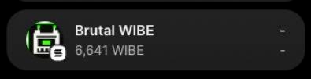

# Brutal wibe

**Brutal wibe** (`truebrutal`) — brutalist on-chain crypto casino on **Solana devnet**. FUN mode for instant play; LIVE mode with Phantom for real testnet bets. Every dice/slot roll is verifiable on [Solana Explorer](https://explorer.solana.com/?cluster=devnet).

**Live:** [truebrutal.netlify.app](https://truebrutal.netlify.app) · Nuxt 3 static SPA · deploys from GitHub via Netlify

---

## WIBE token (devnet)

Casino chip — SPL mint `He66seATY4XobvcwC8WZceMH3uncAqEx44T8HtLyttox` (0 decimals). Phantom may show **“Unknown Token”** or **“Brutal WIBE”** until metadata refreshes — that's normal on devnet.



There is **no public WIBE faucet**. Operator sends test tokens to testers (see [Fund a tester](#fund-a-tester) below). Out of chips? Use the [WIBE Wheel](#wibe-wheel-faucet) (LIVE + wallet only).

---

## Play now

No real money — **Solana devnet only**. Tokens and SOL are test-only.

| Mode | Wallet | Balance | Games |
|------|--------|---------|-------|
| **FUN** (default) | Not required | Virtual credits (1000) | Dice, Slot |
| **LIVE** | Phantom on devnet | On-chain casino PDA | Dice, Slot, Wheel |

### FUN — zero setup

Open [truebrutal.netlify.app](https://truebrutal.netlify.app) → **Glitch Roll** or **Corrupted Reels**. Same FNV-1a RNG math as on-chain; no tokens, no txs.

### LIVE — Phantom + devnet

1. Install [Phantom](https://phantom.app) → switch to **Solana Devnet** (*Settings → Developer Settings → Testnet Mode*).
2. Get devnet SOL for fees: [faucet.solana.com](https://faucet.solana.com) → Devnet.
3. Get WIBE from the operator (mint above).
4. **Connect** on site → **LIVE** → **Deposit** WIBE → play from casino balance.
5. **Withdraw** any time. Verify rolls in the **Fair** tab.

> Each LIVE bet is an on-chain tx — Phantom asks you to approve every roll. That's the provably-on-chain trade-off, not a bug.

Full tester guide: [`iterations/help.md`](iterations/help.md)

### Fund a tester

From the deploy wallet (~10 000 WIBE from `pnpm devnet:setup`):

```bash
spl-token transfer He66seATY4XobvcwC8WZceMH3uncAqEx44T8HtLyttox 1000 <TESTER_ADDRESS> \
  --url devnet --fund-recipient --allow-unfunded-recipient
```

---

## Games

### Glitch Roll (Dice) — `/games/dice`

Roll under/over a target (2–98). FUN or LIVE. Provably fair via **Fair** tab.

**Note:** win payout uses a fixed **1.95× gross** multiplier (before house edge) — it does not scale with displayed win chance. High-chance targets are more player-favourable than low-chance ones.

### Corrupted Reels (Slot) — `/games/slot`

Three reels, pair **×2** or triple **×10** gross multiplier (house edge applied on gross). FUN or LIVE. **Fair** tab verifies reel symbols.

**Note:** a pair win shows net profit after edge (e.g. bet 100, ×2 gross → **+96** net, **196** returned to balance).

### WIBE Wheel (faucet) — `/games/wheel`

Free on-chain chips once every **24h** — **not a bet you can lose**.

| Requirement | Detail |
|-------------|--------|
| **Wallet** | Phantom connected on devnet — **required** |
| **Mode** | **LIVE only** — no FUN version; instruction `spin_wheel` |
| **Cost** | SOL network fee only; first spin may add ~0.001–0.002 SOL rent for `FaucetClaim` + `UserBalance` PDAs |
| **Prize** | 1–1000 WIBE (skewed tiers) credited to casino balance; **Withdraw** to move to wallet |
| **Pool** | Shared on-chain `faucet.remaining`; lobby banner disables when empty |

**UI note:** prize pool may show `—` until you connect Phantom — the pool exists on-chain regardless; connect to spin and see your cooldown.

Operator: initialize pool with `pnpm devnet:faucet` (default 3333 WIBE); vault must hold enough WIBE for withdrawals.

---

## Trust (provably fair)

Dice and Slot — a paranoid player with a block explorer can verify outcomes:

- **Deterministic RNG:** `FNV-1a(blockhash · user_seed · nonce · domain)` — mirror in [`shared/rng-verify.ts`](shared/rng-verify.ts)
- **Blockhash in events:** `DicePlayed` / `SlotPlayed` emit the exact bytes hashed — **Fair** tab matches byte-for-byte
- **Your seed:** client-generated per play — house can't cherry-pick outcomes
- **House edge on-chain:** `house_edge_bps` set at `initialize` (200 bps on deployed devnet)

**Wheel** is a skewed faucet giveaway — auditable on-chain (`WheelSpun` event) but **outside the Fair tab** by design.

---

## For developers

### Docs for agents

- [`AGENTS.md`](AGENTS.md) → [`ai/HANDOFF.md`](ai/HANDOFF.md)
- [`ai/ARCHITECTURE.md`](ai/ARCHITECTURE.md) · [`ai/PLAN.md`](ai/PLAN.md)

### Local dev

```bash
pnpm install
cp .env.example .env
pnpm dev              # http://localhost:3000
pnpm test:env
pnpm test:motion
pnpm test:e2e
pnpm build            # → .output/public
```

### Netlify (production)

| | |
|---|---|
| **Site** | [truebrutal.netlify.app](https://truebrutal.netlify.app) |
| **Build** | `pnpm build` ([`netlify.toml`](netlify.toml)) |
| **Publish** | `.output/public` |
| **Env** | Devnet ids in `netlify.toml` or Netlify dashboard |

Deploy runbook: [`scripts/devnet-deploy.md`](scripts/devnet-deploy.md) · [`ai/specs/deploy.md`](ai/specs/deploy.md)

### Anchor program

```bash
anchor build && anchor test
anchor deploy --provider.cluster devnet
pnpm copy-idl
```

Program id (devnet): `BfdTrxqFfFhe4xA3XniqVWzVkQKX88za5yuA4FRq3ktw`

### Stack

| Layer | Choice |
|-------|--------|
| Chain | Solana devnet |
| Contract | Anchor (`programs/wibe-casino`) |
| Frontend | Nuxt 3 SPA, Tailwind, Pinia, i18n |
| UI | Reka UI + brutalist wrappers |
| Wallet | Phantom |

### Status

**Live on devnet** — FUN + LIVE + WIBE Wheel. Reports: [`iterations/20-readme-license.md`](iterations/20-readme-license.md) · [`iterations/19-final-marathon.md`](iterations/19-final-marathon.md) · QA: [`iterations/help.md`](iterations/help.md)

---

## License

MIT — see [`LICENSE`](LICENSE). Free to read, fork, and learn from; no warranty.

---

## Challenge (original brief)

**Vibe-Code Challenge: Build a Crypto Casino in a Weekend** (May 30–31, 2026)

Hi! We're running a frontend-engineer assessment — **48 hours from 30.05.2026 06:00 GMT+3.**

**Task:** Build a casino on Solana or Ethereum. Users must connect a wallet, deposit test tokens, play, win/lose, withdraw. Logic must be **verifiable on-chain**.

**Constraints:** testnet only · public URL · casino has an edge · any frontend stack · polish UX like a real release.

**Deadline:** before 1 June 2026 06:00 GMT+3 — submit via Telegram @ryazhenkacustomers.

<details>
<summary>Prize pool (original challenge)</summary>

- 🥇 1st place: $1,000 + AI Engineer offer (international iGaming)
- 🥈 2nd place: $500 + candidate offer
- 🥉 3rd place: $200 + candidate offer

</details>

*Brutal wibe placed 🥇 1st in the Vibe-Code Challenge (May 2026).*
