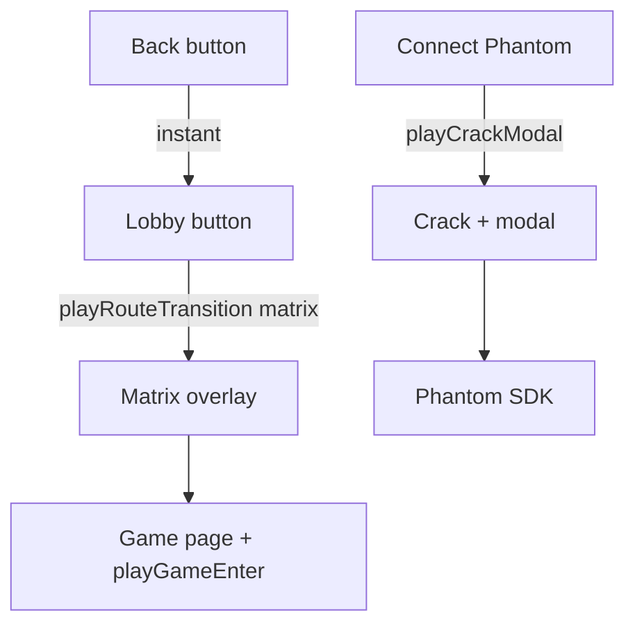

# Итерация 2

## GSAP motion foundation — matrix-переходы и crack-modal кошелька

---

## Что происходило

### PO

- Сохранить простой brutalist UI, но **разрешить и требовать** сложные анимации в ключевых точках.
- Подключить **GreenSock (GSAP)** до передачи Claude.
- **Matrix glitch** при переходе lobby → игра (чёрный + зелёный, код на весь экран).
- **Crack popup** для кошелька — трещина из центра монитора, modal «вылезает» из скола.
- Концепт: **просто + брутально + местами СЛИШКОМ проработано**.

### Архитектор

- `gsap` + client plugin, Pinia `motion` store, единый `useBrutalMotion()`.
- Компоненты: `MatrixTransitionOverlay`, `ScreenCrackOverlay`, `BrutalCrackModal`, `MotionRoot`.
- Wallet: crack → auto Phantom @450ms (wow без лишнего клика).
- Back to lobby: `instant` (без matrix).
- Stubs: `playWinBurst`, `playDepositPulse` для ит.3.
- ADR-011, `ai/specs/ui-motion.md`.

### Реализовано

| Файл | Назначение |
|------|------------|
| `composables/useBrutalMotion.ts` | Единый API |
| `stores/motion.ts` | Lock + overlay state |
| `components/motion/*` | GSAP сцены |
| `plugins/gsap.client.ts` | GSAP defaults |

---

## Статистика

| Метрика | Значение |
|---------|----------|
| Новых motion-компонентов | 4 |
| GSAP hero-сцен | 2 (+ 2 stubs) |
| `pnpm test:motion` | 3/3 ✅ |
| `pnpm test:e2e` | 3/3 ✅ (reduced-motion) |
| `pnpm build` | ✅ |

---

## Ресурсы

| | |
|---|---|
| **Старт** | 30.05.2026, ~17:30 МСК (после ит.1) |
| **USD (Cursor AI)** | PO: дополнить |
| **Время PO** | PO: дополнить |

---

**Коммит:** `feat: iteration 2 — GSAP matrix transitions and crack wallet modal`
