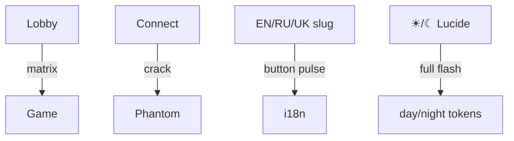

# Итерация 2

## GSAP motion foundation — matrix, crack wallet, theme, locale slugs

> **Статус:** в работе, ещё не закоммичено. 1 итерация = 1 коммит.

---

## Что происходило

### PO

- Сохранить простой brutalist UI, но **разрешить и требовать** сложные анимации в ключевых точках.
- Подключить **GreenSock (GSAP)** до передачи Claude.
- **Matrix glitch** при переходе lobby → игра.
- **Crack popup** для кошелька — ломаные трещины, 3D на ПК.
- **День/ночь** — полноэкранная анимация с иконками (Lucide).
- **Язык** — анимация **только на slug-кнопках** EN / RU / UK, не на всей странице.
- Deploy из Git + [`help.md`](./help.md) для тестера Phantom.

### Архитектор

- `gsap` + Pinia `motion` store, единый `useBrutalMotion()`.
- Hero: `MatrixTransitionOverlay`, `ScreenCrackOverlay`, `BrutalCrackModal`.
- Settings: `SettingsFlashOverlay` — **только theme**; locale — inline GSAP на кнопке.
- Icons: **`lucide-vue-next`** (Sun / Moon).
- Theme: `stores/theme.ts`, ADR-012, day/night CSS tokens.
- Deploy: `vercel.json`, `netlify.toml`, CI, `ai/specs/deploy.md`.

### Реализовано

| API | Эффект |
|-----|--------|
| `playRouteTransition` | Matrix на весь экран |
| `playCrackModal` | Трещины + modal |
| `playLocaleSwitch(apply, btn)` | Только slug-кнопка |
| `playThemeSwitch(sun/moon, apply)` | Full-screen + Lucide |

---

## Статистика

| Метрика | Значение |
|---------|----------|
| Motion-компонентов | 5 |
| GSAP hero-сцен | 3 (+ stubs win/deposit) |
| `pnpm test:motion` | 5/5 ✅ |
| `pnpm build` | ✅ |

---

## Ресурсы

| | |
|---|---|
| **Старт** | 30.05.2026, ~17:30 МСK (после ит.1) |
| **USD (Cursor AI)** | PO: дополнить |
| **Время PO** | PO: дополнить |

---

**Коммит (ожидается):** `feat: iteration 2 — GSAP motion, theme, locale slugs, deploy scaffold`
