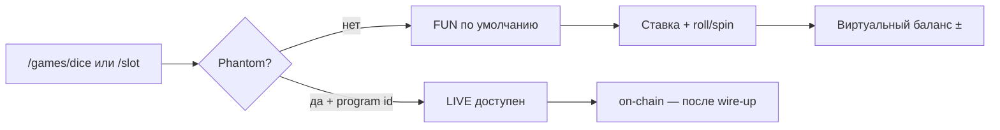

# Итерация 4 — Fun mode (обязательный режим без кошелька)

**Каждая игра запускается сразу:** без Phantom, без депозита, с виртуальным балансом и той же RNG-математикой, что on-chain.

---

## PO → архитектор

> Также хочу зафиксировать обязательно наличие у игр **fun mode** — просто запуск игры даже без авторизации и денег.

**Уточнение:** FUN — режим по умолчанию; LIVE включается только при Phantom + задеплоенной программе.

---

## Реализация

| Слой | Файлы |
|------|--------|
| ADR | [`ai/decisions/014-fun-mode.md`](../ai/decisions/014-fun-mode.md) |
| Ядро | `shared/fun-mode.ts` — виртуальный баланс 1000, симуляция blockhash/u64, house edge 200 bps |
| Режим | `composables/useGameMode.ts` — `fun` default, `canLive` = wallet + `NUXT_PUBLIC_CASINO_PROGRAM_ID` |
| Dice | `useGameDice.ts` → `rollFun()` через `rng-verify`; live — stub (it.4 live wire-up) |
| Slot | `useGameSlot.ts` → `spinFun()`; live — stub |
| UI | `GameModeToggle.vue`, `DiceGame.vue`, `SlotGame.vue` — баннер fun, слайдер, roll/spin, win burst |
| i18n | `games.common.*` fun keys — EN / RU / **UK** |
| Тесты | `tests/motion/fun-mode.test.ts` (в `pnpm test:motion`) |

---

## Как проверить (PO)

1. Открыть `/games/dice` **без** кошелька → режим **FUN**, баланс ~1000.
2. Roll / Spin → результат + анимация при выигрыше.
3. Кнопка **LIVE** disabled или с подсказкой, пока нет Phantom + env program id.
4. То же для `/games/slot`.

---

## Handoff: Claude → Cursor

Claude (it.3) написал план live Dice ([`04-plan-dice-game.md`](./04-plan-dice-game.md)), но **не смог** в sandbox: deploy Anchor, Phantom sign, native build. PO вернулся в **Cursor** для fun mode + дальнейшей live-проводки на хосте.

**Следующий шаг (live):** deploy → IDL → `useCasinoProgram` → `rollLive()` по плану в `04-plan-dice-game.md`.

---

## Проверки (Cursor)

| Что | Результат |
|-----|-----------|
| `pnpm test:motion` | ✅ 8 tests (в т.ч. fun-mode) |
| `pnpm build` | ✅ prerender `/games/dice`, `/games/slot` |
| FUN без wallet | ✅ играбельно |
| LIVE locked без env | ✅ |

---

## Ресурсы

| | |
|---|---|
| **Оператор** | Cursor (возврат после Claude sandbox limits) |
| **Дата** | 30.05.2026 |
| **Токены (Cursor AI)** | _заполнит PO_ |
| **USD** | _заполнит PO_ |
| **Время PO** | _заполнит PO_ |

---

**Коммит (ожидается):** `feat: iteration 4 — mandatory fun mode for dice and slot`
