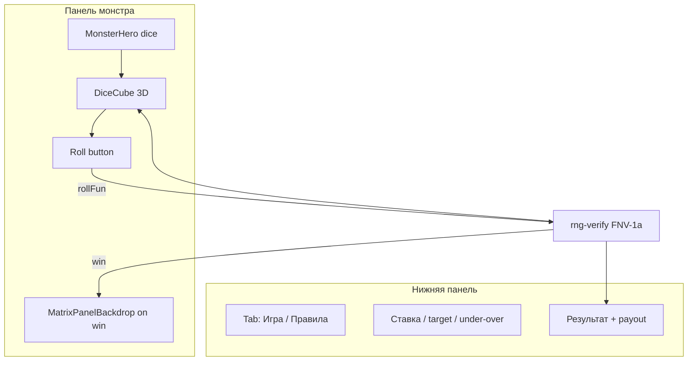

# Итерация 5 — Glitch Roll: первая игра (FUN, играбельна)

**Dice полностью играбелен в FUN:** монстр с кубом, 3D-бросок, matrix на win, табы «Игра / Как играть». LIVE и README-challenge (deposit/Explorer) — **следующая итерация**.

---

## PO → Cursor (после «пропажи» Cloud)

- Ит.3 (монстр-лobby) закоммичен Claude; **Cloud исчерпал лимит сессии (~75%)** — deploy Anchor, Phantom sign, native build в sandbox недоступны.
- PO вернулся в **Cursor** (лимит **$20** исчерпан → продолжение только в Cursor).
- Задачи сессии: fun mode, первая игра dice «вайбово», 3D-куб, кнопка roll под кубом, правила во вкладке, matrix только в панели монстра.

---

## Что сделано

| Блок | Детали |
|------|--------|
| **Fun mode (ADR-014)** | `shared/fun-mode.ts`, `useGameMode`, `GameModeToggle` — default FUN, LIVE locked без program id |
| **Dice logic** | `useGameDice` → `rollFun()` через `rng-verify`, house edge 200 bps, super-win detect |
| **Hero** | `MonsterHero variant="dice"` — тот же монстр, один слот с кубом |
| **3D cube** | `DiceCube.vue` — 6 граней CSS 3D, tumble GSAP, лицом к игроку + sway после броска |
| **UX** | Roll под кубом; результат + payout внизу; вкладки **Игра** / **Как играть** |
| **Win FX** | `MatrixPanelBackdrop` — matrix rain в панели монстра на **любой** win; усиленный на jackpot |
| **Fix** | Горизонтальный скролл при matrix (overflow + узкий scanline) |
| **Slot** | FUN spin сохранён (в scope it.4, без hero-полировки) |
| **i18n** | EN / RU / UK — fun, rules, superWin |
| **Тесты** | `fun-mode`, `rng-verify` (14), motion (8), env (2) |

---

## Что сознательно НЕ в этой итерации

| Пункт README / challenge | Статус |
|--------------------------|--------|
| Deposit / withdraw on-chain | ❌ it.6+ — [`04-plan-dice-game.md`](./04-plan-dice-game.md) |
| Verify on Explorer (LIVE) | ❌ после deploy + IDL |
| Public URL (Vercel) | ❌ PO — [`ai/specs/deploy.md`](../ai/specs/deploy.md) |
| LIVE dice | ❌ stub в `useGameDice.rollLive()` |

**Для демо жюри сейчас:** FUN на `/games/dice` + narrative про verifiable RNG (`rng-verify` ↔ `lib.rs`).

---

## Архитектура первой игры

---

## PO checklist (перед коммитом)

- [ ] `pnpm test:env && pnpm test:motion && pnpm exec vitest run tests/rng-verify.test.ts`
- [ ] `pnpm build`
- [ ] `/games/dice` — FUN без Phantom: roll, win/lose, matrix, таб правил
- [ ] `/games/slot` — FUN spin (smoke)
- [ ] Phantom connect на devnet (smoke, LIVE disabled ok)
- [ ] Reduced motion — roll работает без GSAP tumble

---

## Handoff → it.6 (LIVE + challenge closure)

1. `anchor deploy --provider.cluster devnet` на хосте PO  
2. Env + `pnpm copy-idl`  
3. `useCasinoProgram` + `rollLive` + Verify UI  
4. Vercel + URL в CONTEXT  
5. Slot hero (опционально — копия паттерна dice)

---

## Проверки (Cursor, 30.05.2026)

| Команда | Результат |
|---------|-----------|
| `pnpm test:env` | ✅ 2 |
| `pnpm test:motion` | ✅ 8 |
| `tests/rng-verify.test.ts` | ✅ 14 |
| `pnpm build` | ✅ `/games/dice` prerender |

---

## Ресурсы

| | |
|---|---|
| **Оператор** | Cursor (возврат после исчезновения Cloud / лимита Cowork) |
| **Cloud it.3** | ~1 ч PO, ~75% лимита сессии — deploy не выполнен |
| **Cursor it.4–5** | см. ниже |
| **Токены (Cursor AI)** | лимит **$20** (included) — исчерпан в этой фазе |
| **USD** | **~$20** (Cursor included cap) |
| **Время PO** | **~1 ч** (ручной контроль: fun mode + dice polish + QA) |

---

**Коммит:** `feat: iteration 5 — glitch roll dice (FUN playable, 3D cube, monster hero)`

**Scope коммита:** все изменения с it.3 (включая it.4 fun mode + dice UX), кроме `.idea/`.
