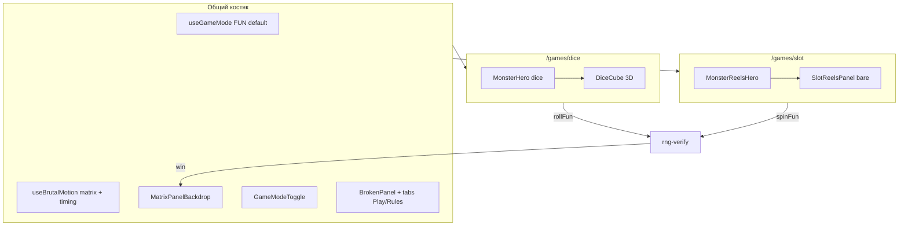

# Итерация 6 — Corrupted Reels + polish обеих игр (FUN)

**Вторая игра играбельна в FUN** — отдельный маскот с барабанами в голове (циклопов глаз), 3D-flip ячеек, стабильный layout. Dice и slot делят один костяк: hero-stage, tabbed panel, matrix на win, fun mode.

---

## PO → Cursor

> Завершить it.6: slot как dice по паттерну, но с «одноруким бандитом» в голове монстра. ~15 мин финальных доработок по обеим играм — без прыжков layout при кликах.

---

## Реализация

| Блок | Файлы / детали |
|------|----------------|
| **Slot hero** | `MonsterReelsHero.vue` — отдельный маскот; 3 bare-барабана в голове, глаз заполняет вырез |
| **Bandit UI** | `SlotReelsPanel.vue` — 3D flip 180° per cell, front/back faces, flicker RNG |
| **Motion** | `playSlotSpin()` — только тайминг; flip + antenna CSS; кнопка spin статична |
| **Logic** | `useGameSlot` → `computeReels`, pair ×2 / triple ×10, `isSlotSuperWin` |
| **Dice + slot UX** | Стабильный layout: `bw-game-result-slot`, grid-tabpanels, hero min-height |
| **Button** | `BrutalButton` — loading overlay без смены высоты |
| **Lobby dice hero** | `MonsterHero` — только lobby/dice (slot вынесен) |
| **i18n** | EN / RU / UK — slot tabs, rules, superWin |

---

## Архитектура костяка игры (обе игры)

---

## PO checklist

- [x] `pnpm test:env && pnpm test:motion && vitest rng-verify`
- [x] `pnpm build` — `/games/dice`, `/games/slot` prerender
- [x] `/games/slot` FUN: spin, 3D flip, matrix на win
- [x] `/games/dice` FUN: roll, layout не прыгает при табах / spin
- [ ] LIVE `play_slot` / deploy — it.7+

---

## Не в scope

- Anchor deploy, IDL, deposit/withdraw, Verify Explorer, public URL

---

## Проверки (Cursor, 30.05.2026)

| Команда | Результат |
|---------|-----------|
| `pnpm test:env` | ✅ 2 |
| `pnpm test:motion` | ✅ 8 |
| `tests/rng-verify.test.ts` | ✅ 14 |
| `pnpm build` | ✅ |

---

## Ресурсы

| | |
|---|---|
| **Оператор** | Cursor |
| **Дата** | 30.05.2026, ~19:00 МСК |
| **Токены (Cursor AI)** | included cap (продолжение после it.5) |
| **USD** | ~$20 included (сессия PO) |
| **Время PO** | **~15 мин** финальные доработки + it.6 slot hero; **~1 ч** суммарно it.5–6 в Cursor |

---

**Коммит:** `8ddfcaa` — `feat: iteration 6 — corrupted reels slot, stable game layout (FUN both games)`
