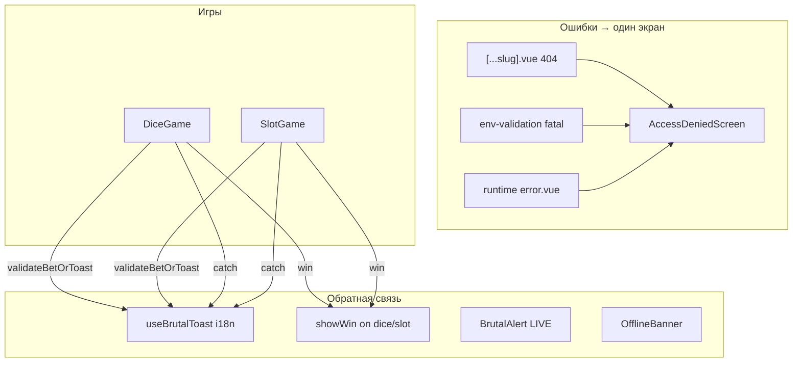

# Итерация 7 — Access Denied + UX-оболочка (ошибки, тосты, скелетоны)

**Единый brutalist UX для сбоев и обратной связи:** fullscreen «Access denied» с вечной matrix-анимацией, i18n-тосты, win-success, offline-баннер, LIVE-alert, валидация ставки, скелетон баланса.

---

## PO → Cursor

> До ресета Cloud — улучшить UX/UI: страницы ошибок (один дизайн), тосты на языках, скелетоны где нужно. Плавающий «Access denied» с танцующими буквами + бесконечный glitch как при переходе роутов. Потом — win-тосты, offline, LIVE modal, env через тот же экран.

**Время PO:** ~30 мин (ручной контроль + QA).

---

## Реализация

| Блок | Файлы / детали |
|------|----------------|
| **Error page** | `error.vue` + `AccessDeniedScreen.vue` — matrix rain (`useMatrixRain`), loop scanline/slices, `UiDancingText` |
| **404** | `pages/[...slug].vue` → `createError(404)` → тот же экран |
| **Env** | `plugins/env-validation.client.ts` → `showError(fatal)` вместо `<pre>` |
| **Тосты i18n** | `useBrutalToast` + `shared/wibe-error-i18n.ts` — title/message из `errors.codes.*` (EN/RU/UK) |
| **Win success** | `showWin(delta, superWin)` — dice + slot после matrix |
| **LIVE blocked** | `GameModeToggle` → `BrutalAlert` (нет wallet / нет program id) |
| **Ставка** | `useBetField` — красная рамка + тост `INVALID_BET` до roll/spin |
| **Offline** | `useNetworkStatus` + `OfflineBanner` — sticky баннер + тост при disconnect |
| **Loading** | `NuxtLoadingIndicator` в `app.vue` — accent scanline |
| **Skeleton** | `UiBrutalSkeleton` — `BalanceDisplay` при `useCasinoProgram.loading` |

---

## Архитектура UX-оболочки

---

## PO checklist (перед коммитом)

- [ ] `pnpm test:env && pnpm test:motion && pnpm exec vitest run tests/rng-verify.test.ts`
- [ ] `pnpm build`
- [ ] `/games/nope` → Access denied + dancing letters + «← Force lobby»
- [ ] Смена locale → «Доступ запрещён» / «Доступ заборонено»
- [ ] Win в dice/slot → green toast + matrix
- [ ] LIVE без Phantom → modal, не silent disabled
- [ ] Bet `0` → красный input + тост
- [ ] DevTools Offline → баннер + тост
- [ ] Reduced motion — dancing chars / skeleton pulse отключены

---

## Не в scope (it.8+)

- Anchor deploy, IDL, `rollLive` / `spinLive`
- Verify Explorer UI
- Public URL (Vercel)
- Глобальный `vue:error` handler (можно добавить позже)

---

## Проверки (Cursor, 30.05.2026)

| Команда | Результат |
|---------|-----------|
| `pnpm test:env` | ✅ 2 |
| `pnpm test:motion` | ✅ 8 |
| `tests/rng-verify.test.ts` | ✅ 14 |
| `pnpm build` | ✅ |

---

## Файлы для staging (PO коммитит сам)

**Новые:**
- `error.vue`
- `pages/[...slug].vue`
- `components/motion/AccessDeniedScreen.vue`
- `components/ui/DancingText.vue`
- `components/ui/BrutalSkeleton.vue`
- `components/layout/OfflineBanner.vue`
- `composables/useMatrixRain.ts`
- `composables/useBetField.ts`
- `composables/useNetworkStatus.ts`
- `shared/wibe-error-i18n.ts`

**Изменённые:**
- `app.vue`
- `assets/css/brutalism.css`
- `plugins/env-validation.client.ts`
- `composables/useBrutalToast.ts`
- `components/games/DiceGame.vue`
- `components/games/SlotGame.vue`
- `components/games/GameModeToggle.vue`
- `components/wallet/BalanceDisplay.vue`
- `i18n/locales/{en,ru,uk}.json`

---

## Ресурсы

| | |
|---|---|
| **Оператор** | Cursor |
| **Дата** | 30.05.2026 |
| **Токены (Cursor AI)** | included cap (сессия PO) |
| **USD** | ~$20 included (общий лимит сессии) |
| **Время PO** | **~30 мин** |

---

**Коммит (PO):** _(hash после push)_ — см. сообщение ниже
