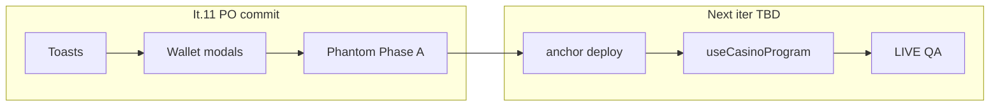

# Итерация 11

## Мобилка, тосты, Phantom Phase A, wallet UX

> Оператор: Cursor. **Коммит — только PO.** LIVE депозиты — после закрытия it.11, отдельная итерация.

## PO → задача

После итераций Cloud (8–10): тосты на мобилке, mobile QA, Phantom devnet connect (без on-chain), нормальные модалки connect/disconnect.

## Реализация

### Тосты

Viewport был `fixed bottom-4 right-4 w-full max-w-sm` — на 320px stack вылезал за левый край.

| Файл | Изменение |
|------|-----------|
| `BrutalToastHost.vue` | `.bw-toast-viewport` |
| `brutalism.css` | inset left/right, safe-area, max-width, scroll на длинном тексте |
| `BrutalToast.vue` | `overflow-wrap: anywhere` |

### Mobile QA

| Зона | Фикс |
|------|------|
| Game tabs 320px | меньший font, перенос на `.bw-dice-tabs__btn` |
| Horizontal scroll | `overflow-x: clip` на `html` |
| Header wallet | `min-w-0`, wrapper `bw-wallet-connect` |

### Wallet connect / disconnect UX

| Проблема | Fix |
|----------|-----|
| Crack-modal фон не на весь экран | `.bw-motion-crack-scrim` — `fixed inset 0`, отдельно от iOS-anchored content |
| Disconnect сразу по клику | Confirm «Разорвать связь?» через `BrutalAlert` |
| Hover «Отключить?» на мобилке | только `@media (hover: hover) and (pointer: fine)` |
| Модалка по центру **страницы**, не экрана | `BrutalAlert` → `<Teleport to="body">` + `useViewportAnchor` (как crack-modal) |
| 2-й цикл connect/disconnect — только затемнение | z-index alert > motion; сброс GSAP/timers в crack-modal; alert не через Reka Portal |

| Файл | Изменение |
|------|-----------|
| `BrutalCrackModal.vue` | scrim + stage; `clearPhaseCloseTimer`, guard в `close()` |
| `BrutalAlert.vue` | Teleport + viewport anchor, без Reka Portal |
| `ConnectButton.vue` | disconnect confirm, i18n EN/RU/UK |
| `brutalism.css` | `.bw-alert-*`, `.bw-btn--wallet-connected` |

### Документация Phase A

[`help.md`](./help.md): FUN без env, Netlify, мобилка, Phantom, что до LIVE deploy не работает.

## PO — проверено ✅

- [x] Phantom devnet connect / disconnect (несколько циклов)
- [x] Disconnect confirm по центру **экрана** (в т.ч. после scroll на game page)
- [x] Crack-modal фон на весь viewport
- [ ] DevTools 320/390 — тосты win / auto-roll (PO)
- [ ] **Коммит + hash в README** — делает PO (включить `.github/workflows/ci.yml` — pnpm fix)

### CI (GitHub Actions)

`pnpm/action-setup` с `version: 10` конфликтовал с `packageManager: pnpm@10.6.5` в `package.json`. Убран `version` из workflow — версия только из `packageManager`.

## После it.11 — LIVE devnet (следующая итерация, PO + Cursor)

| Шаг | Действие |
|-----|----------|
| 1 | `anchor keys sync` → `anchor build` → `anchor deploy --provider.cluster devnet` |
| 2 | SPL mint + `initialize(house_edge_bps)` |
| 3 | `.env` / Netlify: 4× `NUXT_PUBLIC_*` |
| 4 | `pnpm copy-idl` → wire `useCasinoProgram` |
| 5 | LIVE в играх + QA deposit → play → withdraw |

Спека: [`ai/specs/testnet-readiness.md`](../ai/specs/testnet-readiness.md), [`04-plan-dice-game.md`](./04-plan-dice-game.md).

| | |
|---|---|
| **Оператор** | Cursor |
| **Build** | `NUXT_IGNORE_LOCK=1 pnpm build` ✅ |
| **Коммит** | **PO** (агент не коммитит) |
| **Время PO** | ~30–45 мин (mobile + wallet cycles + commit) |
