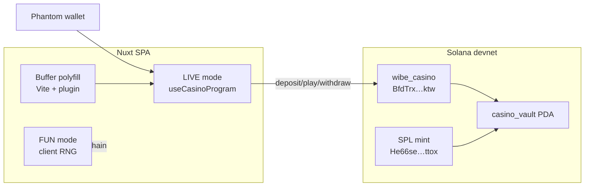

# Итерация 12

## LIVE devnet: wire клиента, deploy программы, Buffer fix, готовность Netlify

> Оператор: Cursor. **Коммит — только PO.** Первая реальная итерация с testnet (devnet).

## PO → задача

1. Не путать LIVE с «доступным» при placeholder env (`Wibe1111…` / `Token1111…`).
2. Wire `useCasinoProgram`: deposit / play / withdraw для Dice и Slot.
3. Deploy `wibe_casino` на **devnet**, mint тестовых SPL, initialize casino.
4. Починить `Buffer is not defined` — локалка и production SPA.
5. Подготовить Netlify: 4× `NUXT_PUBLIC_*`, build, e2e.

## Архитектор → уточнения

| Решение | Почему |
|---------|--------|
| `isRealChainConfig()` | LIVE только при **обоих** реальных pubkey, не skeleton из `.env.example` |
| Segmented radio FUN/LIVE | Визуально отделить demo от chain; alert если wallet/env не готов |
| IDL в `types/idl/` + `accountsStrict` | Anchor 0.30, camelCase keys в клиенте |
| `vite-plugin-node-polyfills` | spl-token грузится при router init **до** Nuxt plugins — polyfill на уровне Vite |
| `pnpm devnet:setup` one-shot | deploy → mint → initialize → 10k tokens на Phantom PO |

## Реализация

### FUN/LIVE + env gate

| Файл | Изменение |
|------|-----------|
| `GameModeToggle.vue` | Segmented radio (`.bw-seg`), строка «Сейчас: FUN/LIVE» |
| `shared/casino-env.ts` | `isRealChainConfig`, игнор placeholders |
| `useGameMode.ts` | LIVE gated через `isConfigured` |

### On-chain client

| Файл | Изменение |
|------|-----------|
| `types/idl/wibe_casino.json` | IDL (struct defs в `types[]` для Anchor 0.30) |
| `shared/casino-pdas.ts` | PDA helpers |
| `useWallet.ts` | `signTransaction` / `signAllTransactions` |
| `useCasinoProgram.ts` | deposit, withdraw, playDice, playSlot, refreshBalance |
| `useGameDice.ts` / `useGameSlot.ts` | LIVE paths |
| `wallet/CasinoActions.vue` | Deposit / withdraw / max на game pages |

### Devnet deploy (выполнено на macOS host)

| Артефакт | Значение |
|----------|----------|
| Program ID | `BfdTrxqFfFhe4xA3XniqVWzVkQKX88za5yuA4FRq3ktw` |
| Token mint | `He66seATY4XobvcwC8WZceMH3uncAqEx44T8HtLyttox` |
| House edge | 200 bps (on-chain + FUN) |
| Deploy wallet | `GaUXMmy55S8ug5Yz465j3NcKDUKahAxQpVH4sJ16pz5Y` |
| Phantom PO (demo tokens) | `6w5mMais6m5YX6b9KFv8QY2XqqdaRQ5FjfMuK23WJcT3` |
| Скрипт | `pnpm devnet:setup` (`scripts/devnet-setup.mjs`) |
| Balance check | `pnpm devnet:balance` (без retry faucet) |

Program features: `init-if-needed` на user balance, borrow fix в withdraw.

### Buffer / browser SPA

| Файл | Изменение |
|------|-----------|
| `nuxt.config.ts` | `vite-plugin-node-polyfills` (Buffer, process, global) |
| `plugins/00.buffer-polyfill.client.ts` | ранний fallback `globalThis.Buffer` |
| `build.transpile` | `@coral-xyz/anchor`, `@solana/spl-token` |
| `tests/e2e/buffer-check.spec.ts` | регрессия «Buffer is not defined» на lobby boot |

### Deploy docs + QA automation

| Файл | Изменение |
|------|-----------|
| `.env.example` | комментарии с live devnet id |
| `ai/specs/deploy.md` | Netlify env, FUN vs LIVE |
| `scripts/devnet-deploy.md` | PO runbook toolchain → QA |
| `tests/e2e/smoke.spec.ts` | locale switcher EN/RU/UK dropdown |
| `tsconfig.json` | exclude anchor test file из `pnpm typecheck` |

## Инфографика



### Статус challenge requirements

| Требование | Статус |
|------------|--------|
| Testnet only | ✅ devnet |
| Wallet connect | ✅ Phantom Phase A |
| Deposit → play → withdraw | ✅ код + devnet deploy; **PO LIVE QA** |
| Verifiable on-chain | ✅ Explorer + Fair tab + events |
| Public URL | ⏳ PO: Netlify env + deploy |
| Two games | ✅ Dice + Slot FUN/LIVE |
| Casino edge | ✅ 200 bps |

## PO — commit checklist

Файлы it.12 (агент **не коммитит**):

- Chain client: `useCasinoProgram`, `CasinoActions`, `casino-env`, `casino-pdas`, IDL, game composables
- Program: `programs/wibe-casino/`, `Anchor.toml`, `Cargo.lock`
- Buffer: `nuxt.config.ts`, `plugins/00.buffer-polyfill.client.ts`, `package.json`, lockfile
- Scripts: `scripts/devnet-setup.mjs`, `devnet-airdrop.mjs`, `devnet-deploy.md`
- Tests: `buffer-check.spec.ts`, `smoke.spec.ts` fix
- Docs: этот отчёт, `iterations/README.md`, `ai/CONTEXT.md`, `help.md`, `deploy.md`, `.env.example`

```bash
pnpm test:env && pnpm test:motion && pnpm exec playwright test
NUXT_IGNORE_LOCK=1 pnpm build
```

## PO — Netlify deploy (следующий шаг)

Site settings → Environment variables (**Production**):

| Variable | Value |
|----------|-------|
| `NUXT_PUBLIC_SOLANA_NETWORK` | `devnet` |
| `NUXT_PUBLIC_SOLANA_RPC_URL` | `https://api.devnet.solana.com` |
| `NUXT_PUBLIC_CASINO_PROGRAM_ID` | `BfdTrxqFfFhe4xA3XniqVWzVkQKX88za5yuA4FRq3ktw` |
| `NUXT_PUBLIC_CASINO_TOKEN_MINT` | `He66seATY4XobvcwC8WZceMH3uncAqEx44T8HtLyttox` |

Build: `pnpm build` → publish `.output/public` ([`netlify.toml`](../netlify.toml)).

## PO — LIVE QA (локально или после deploy)

1. Phantom → **Devnet**, кошелёк `6w5m…JcT3` (или свой с devnet tokens).
2. `pnpm dev` — lobby без `Buffer is not defined`.
3. Dice/Slot → **LIVE** → Deposit → Roll/Spin → Withdraw.
4. Fair tab → signature в [Explorer devnet](https://explorer.solana.com/?cluster=devnet).

## PO — проверено агентом ✅

- [x] `pnpm build` — static SPA `.output/public`
- [x] `pnpm test:env` — env contract
- [x] `pnpm test:motion` — 8 tests
- [x] `pnpm exec playwright test` — 4/4 (smoke + buffer)
- [x] `pnpm devnet:setup` — program + mint + init + 10k tokens
- [ ] **PO:** LIVE QA deposit/play/withdraw (локально или Netlify)
- [ ] **PO:** commit + hash в README
- [ ] **PO:** live URL в `ai/CONTEXT.md`

| | |
|---|---|
| **Оператор** | Cursor (код + devnet setup) |
| **Build** | `pnpm build` ✅ · e2e 4/4 ✅ |
| **Program devnet** | `BfdTrxqFfFhe4xA3XniqVWzVkQKX88za5yuA4FRq3ktw` |
| **Коммит** | **PO** |
| **Токены (Cursor AI)** | … (Usage dashboard) |
| **USD** | … |
| **Время PO** | … ч (deploy + LIVE QA + commit) |
