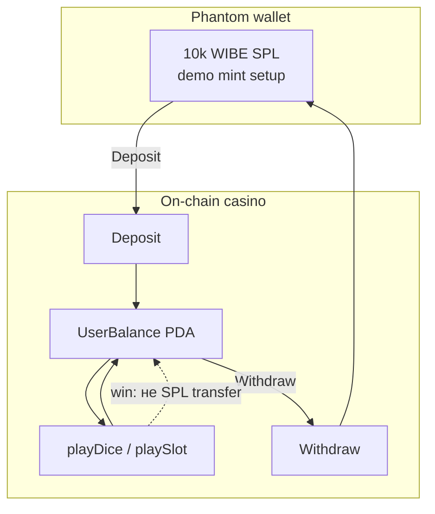

# Итерация 13

## LIVE UX: балансы WIBE, Phantom metadata, Fair tab, win toasts

> Оператор: Cursor. **Коммит it.13** — после PO QA на [truebrutal.netlify.app](https://truebrutal.netlify.app).

## PO → задача

После деплоя it.12 на Netlify:

1. LIVE locked → env в `netlify.toml` (it.12, коммит `40e3df4`).
2. Непонятно где баланс / что ставишь / «+0 кредитов» при win.
3. Phantom: **10 000 Unknown Token** `He66se…` — кажется выплатой за win.
4. Аудит: соответствие challenge + работа методов deposit/play/withdraw/Fair.

## Архитектор → уточнения

| Наблюдение | Объяснение |
|------------|------------|
| 10 000 в Phantom | Demo mint из `pnpm devnet:setup`, **не** payout за win |
| Unknown Token | SPL mint без Metaplex metadata → Phantom не знает имя WIBE |
| Win не в кошелёк | On-chain меняет **UserBalance PDA**; SPL в Phantom только после **Withdraw** |
| Ставка 1 → net +0 | Integer math on-chain: `1×1.95=1` → чистый профит 0 |
| Fair tab LIVE | Meta хранила `blockhashBase58`, UI читала `blockhash` → verify ломался |

## Реализация

### LIVE funds UX (`GamePlayFunds.vue`)

| Элемент | Изменение |
|---------|-----------|
| Баланс казино | WIBE + deposit CTA |
| Баланс Phantom | `walletTokenBalance` из `useCasinoProgram` |
| Баннер | wallet ≠ casino; «депозит сначала» |
| Ставка | подпись `(WIBE)`, hint min bet ≥ 2 |
| Phantom hint | Unknown Token + mint short |

### Win toasts + payout LIVE

| Файл | Изменение |
|------|-----------|
| `useGameDice.ts` / `useGameSlot.ts` | `payoutDelta` в LIVE meta через `diceNetDelta` / `slotNetDelta` |
| `useBrutalToast.ts` | `breakEven` / `breakEvenLive` / `live` messages |
| `shared/format-tokens.ts` | `TOKEN_SYMBOL = 'WIBE'` |

### Provably Fair LIVE

| Файл | Изменение |
|------|-----------|
| `ProvablyFair.vue` | `resolveBlockhash()` — bytes или `blockhashBase58` |
| `useCasinoProgram.ts` | `fetchRngBlockhashBytes()` — sysvar[0..32] как в program |
| `shared/rng-verify.ts` | `base58Encode` |
| `tests/rng-verify.test.ts` | fix `verifySlot` vectors |

### Phantom WIBE metadata

| Файл | Изменение |
|------|-----------|
| `scripts/devnet-token-metadata.mjs` | Metaplex metadata → **Brutal WIBE (WIBE)** |
| `pnpm devnet:token-meta` | one-shot на mint `He66se…` |
| `iterations/help.md` | таблица Unknown / 10k / withdraw flow |

## Инфографика

### Challenge checklist (после it.13)

| Требование | Статус |
|------------|--------|
| Testnet only | ✅ devnet |
| Connect wallet | ✅ Phantom |
| Deposit → play → withdraw | ✅ LIVE QA PO на Netlify |
| Verifiable on-chain | ✅ events + Fair tab (LIVE blockhash fix) |
| Public URL | ✅ truebrutal.netlify.app |
| Casino edge | ✅ 200 bps |
| Two games | ✅ Dice + Slot |
| Polished UX | ✅ балансы, WIBE, hints, metadata |

## PO — проверено ✅

- [x] On-chain: program + mint + house_edge 200 bps (RPC check)
- [x] `pnpm test:env` + `test:motion` + `rng-verify` 14/14
- [x] `pnpm build` OK
- [x] `pnpm devnet:token-meta` — metadata на devnet mint
- [x] PO: LIVE на Netlify — connect, deposit, play, withdraw
- [x] PO: понятно 10k = setup, win → casino balance

## PO — commit checklist

- `GamePlayFunds.vue`, Dice/Slot, CasinoActions, BalanceDisplay
- `useCasinoProgram`, game composables, `useBrutalToast`
- `ProvablyFair.vue`, `rng-verify.ts`, tests
- `scripts/devnet-token-metadata.mjs`, `help.md`, i18n EN/RU/UK
- этот отчёт, `iterations/README.md`, `ai/CONTEXT.md`

| | |
|---|---|
| **Оператор** | Cursor |
| **Live URL** | [truebrutal.netlify.app](https://truebrutal.netlify.app) |
| **Mint** | `He66seATY4XobvcwC8WZceMH3uncAqEx44T8HtLyttox` (WIBE metadata) |
| **Build** | test:env + motion + rng 14/14 + build ✅ |
| **Коммит** | `a161342` |
| **USD** | … |
| **Время PO** | … ч (LIVE QA Netlify + Phantom) |
