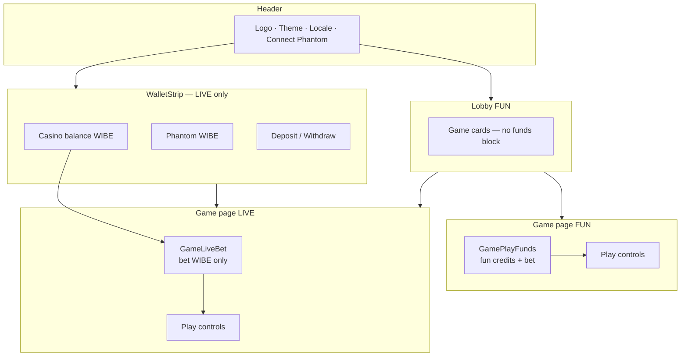

# Итерация 14

## UX split: глобальная LIVE-полоска, FUN только в играх, без дублирования WIBE

> Оператор: Cursor. **Коммит — только PO.** Следует за it.13 (LIVE UX WIBE).

## PO → задача

После it.13 на Netlify и локалке:

1. **Задвоение полей** — в LIVE на странице игры одновременно показывались баланс казино, Phantom, депозит/вывод и ставка; то же дублировалось с лobby (`WalletBalanceDisplay`).
2. **FUN vs LIVE путаница** — toggle показывал LIVE, но игра могла оставаться в FUN (разные экземпляры `useGameMode`).
3. **FUN должен быть чистым** — только виртуальные fun-кредиты на страницах игр; никаких WIBE / депозита / Phantom в game panel.
4. **LIVE funds — глобально** — балансы и deposit/withdraw под хедером на всех страницах, когда кошелёк подключён и режим LIVE.

## Архитектор → уточнения

| Решение | Почему |
|---------|--------|
| `LayoutWalletStrip` в `app.vue` | Один источник правды для LIVE funds; виден на lobby и в играх |
| Strip только при `connected && isConfigured && !isFun` | FUN-lobby и FUN-игры без chain UI |
| `GamePlayFunds` — FUN-only | Виртуальный баланс + ставка в fun credits; без токенов |
| `GameLiveBet` — только ставка (WIBE) | Баланс/deposit уже в strip — нет дубля |
| Убрать `WalletBalanceDisplay` с lobby | Strip покрывает LIVE; в FUN баланс не нужен |
| Shared `useGameMode` (module-level ref) | Toggle, strip и game composables читают один mode |
| Auto-LIVE при connect + `funPinnedWhileLive` | После Phantom → LIVE; если юзер явно выбрал FUN — не переключать обратно |

## Реализация

### Глобальная LIVE-полоска

| Файл | Изменение |
|------|-----------|
| `components/layout/WalletStrip.vue` | **новый** — casino balance, Phantom WIBE, CTA deposit, `CasinoActions` |
| `app.vue` | `<LayoutWalletStrip />` сразу под `<LayoutAppHeader />` |
| `wallet/CasinoActions.vue` | Только из strip; `showPanel = connected && isConfigured` |
| `pages/index.vue` | Убран `<WalletBalanceDisplay />` |

Strip: `position: sticky`, `top: var(--bw-header-height)`, `z-index: 40`.

### Игры: split FUN / LIVE UI

| Файл | Изменение |
|------|-----------|
| `games/GamePlayFunds.vue` | Урезан до FUN: баннер, fun balance, bet `(fun credits)` |
| `games/GameLiveBet.vue` | **новый** — только bet `(WIBE)` + hint «из полоски выше» |
| `games/DiceGame.vue` | `v-if isFun` → PlayFunds, `v-else` → LiveBet; убран `walletTokenBalance` |
| `games/SlotGame.vue` | То же |

### Shared game mode + connect UX

| Файл | Изменение |
|------|-----------|
| `composables/useGameMode.ts` | Module-level `mode` ref; auto-LIVE; pin FUN при явном выборе |
| `wallet/ConnectButton.vue` | Toast `wallet.connectedLive` после connect при `isConfigured` |

### Toasts (регрессия it.11)

| Файл | Изменение |
|------|-----------|
| `BrutalToastHost.vue` | `<Teleport to="body">` — viewport-fixed, не привязан к низу app |
| `assets/css/brutalism.css` | `.bw-toast-viewport` z-index 200 |

### i18n EN / RU / UK

| Ключ | Смысл |
|------|-------|
| `games.common.funBalanceLabel` | Подпись fun-баланса |
| `games.common.liveBetHint` | Ставки из strip |
| `games.common.liveNeedDeposit` | «Депозит здесь — баланс казино 0» (не «блок ниже») |
| `games.common.liveBanner` | «полоска выше», не «блок ниже» |

## Инфографика

### UX matrix (it.14)

| Страница | FUN | LIVE (connected + env) |
|----------|-----|------------------------|
| Lobby | Нет funds UI | Strip: балансы + deposit |
| Dice / Slot Play tab | Fun balance + bet (credits) | Strip + bet (WIBE) only |
| Deposit / withdraw | — | Только в strip |
| Header | Connect только | Connect только |

## PO — проверить

- [ ] FUN lobby — нет баланса, нет strip
- [ ] FUN Dice/Slot — fun credits, нет WIBE / deposit в panel
- [ ] Connect Phantom + env → auto LIVE (если не pin FUN)
- [ ] LIVE lobby + games — strip sticky под header
- [ ] Deposit в strip → pulse → casino balance ↑ → bet в game
- [ ] Toggle FUN → strip скрывается, PlayFunds с fun credits
- [ ] Toggle LIVE обратно → strip снова, GameLiveBet без дубля баланса
- [ ] Win toast — в viewport экрана (Teleport), не обрезан
- [ ] Connect toast «LIVE mode on…» при реальном env
- [ ] EN / RU / UK — funBalanceLabel, liveBetHint, liveNeedDeposit
- [ ] `pnpm build` OK

## PO — commit checklist

- `components/layout/WalletStrip.vue`, `components/games/GameLiveBet.vue`
- `GamePlayFunds.vue`, `DiceGame.vue`, `SlotGame.vue`
- `app.vue`, `pages/index.vue`, `CasinoActions.vue`
- `useGameMode.ts`, `ConnectButton.vue`
- `BrutalToastHost.vue`, `brutalism.css`
- `i18n/locales/en.json`, `ru.json`, `uk.json`
- этот отчёт, `iterations/README.md`, `iterations/help.md` (strip вместо «блок ниже»), `ai/CONTEXT.md`

| | |
|---|---|
| **Оператор** | Cursor |
| **Live URL** | [truebrutal.netlify.app](https://truebrutal.netlify.app) |
| **Program** | `BfdTrxqFfFhe4xA3XniqVWzVkQKX88za5yuA4FRq3ktw` |
| **Mint** | `He66seATY4XobvcwC8WZceMH3uncAqEx44T8HtLyttox` |
| **Build** | `pnpm build` ✅ |
| **Коммит** | _(PO)_ |
| **USD** | … |
| **Время PO** | … ч (strip + FUN/LIVE split QA) |
