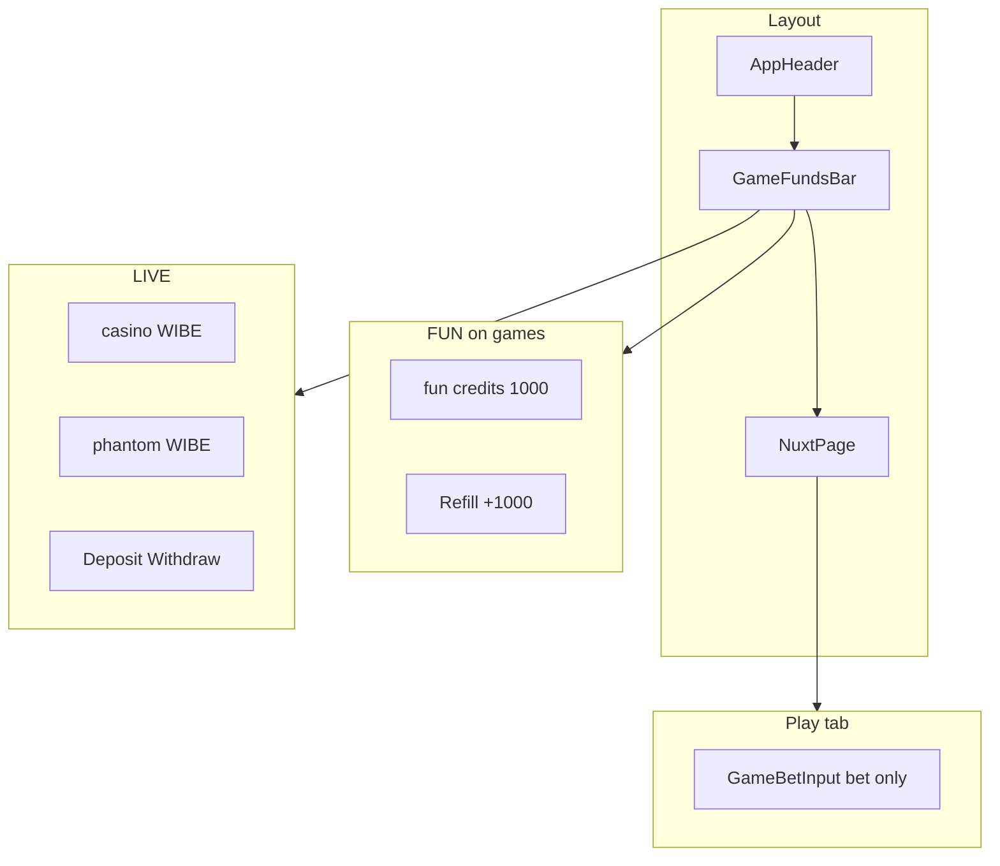

# Итерация 15

## Рабочий депозит + единый GameFundsBar (FUN refill / LIVE deposit)

> Оператор: Cursor. **Коммит it.15 — только PO.** Закрывает UX-дыры it.14 + делает LIVE funds submission-ready.

## PO → задача

После it.14 на Netlify / локалке:

1. **Deposit «прошёл» в Phantom** (списалось 200 WIBE), но UI показывал **—** — casino / Phantom balance не обновлялись.
2. **Задвоение funds UI** — fun-баланс + refill в game panel, LIVE deposit и в strip, lobby `BalanceDisplay`.
3. **FUN vs LIVE путаются** — auto-LIVE, strip скрыт в FUN, блоки перекрывают друг друга.
4. **Challenge README** — нужен стабильный цикл wallet → deposit → play → withdraw без «chain rejected / account not found» без пояснений.
5. **Финальный аудит** — ai/ docs, dead code, duplicate watchers, submission checklist.

## Архитектор → уточнения

| Наблюдение | Объяснение |
|------------|------------|
| «—» при подключённом Phantom | `watch(refreshBalance)` **без `immediate: true`** — auto-connect до mount → refresh никогда не вызывался |
| Списалось, toast ошибки | Tx мог пройти; `refreshBalance()` после deposit падал → UI `null`, пользователь думал что fail |
| UserBalance not found | Play/withdraw до первого deposit; deposit создаёт PDA через on-chain `init_if_needed` |
| FUN block в panel | PO: funds **только в GameFundsBar**; panel — **bet only** |
| Lobby funds | PO: bar на lobby **только LIVE + connected**; на играх — **всегда** (FUN или LIVE) |
| Unknown Token в Phantom | Metaplex metadata — `pnpm devnet:token-meta` (it.13), не баг it.15 |

## Реализация

### Chain client (`useCasinoProgram.ts`)

| Изменение | Детали |
|-----------|--------|
| `watch(..., { immediate: true })` | Баланс при auto-connect Phantom |
| `balanceWatchRegistered` | Один watch на приложение (не N watchers из каждого компонента) |
| `readUserBalanceAmountRaw` | Fallback decode UserBalance (offset 8, u64 LE) |
| `refreshBalanceAfterTx` | confirm tx + retry 0/300/600/1200 ms |
| Safe defaults | При ошибке refresh → `0`, не вечный `null` |
| Deposit | preflight; `skipPreflight` только fallback для first PDA |
| Errors | `DEPOSIT_REQUIRED`, `CASINO_NOT_INITIALIZED` |

### Единый GameFundsBar

| Файл | Роль |
|------|------|
| `components/layout/GameFundsBar.vue` | **new** — единый блок под header |
| FUN (`isFun`) | fun credits + **Refill** (+1000) |
| LIVE (`connected + env`) | casino WIBE + Phantom WIBE + ↻ + `CasinoActions` |
| Видимость | `/games/*` always; lobby — `LIVE + connected` |
| LIVE без wallet на game | hint «Connect Phantom» |
| `app.vue` | `<LayoutGameFundsBar />` |

**Удалено:** `WalletStrip.vue`, `GamePlayFunds.vue`, `GameLiveBet.vue`, `BalanceDisplay.vue`

### Game panel

| Файл | Роль |
|------|------|
| `components/games/GameBetInput.vue` | **new** — только bet (`fun credits` / `WIBE`) |
| `DiceGame.vue` / `SlotGame.vue` | один input; убран reset fun внизу |

### Shared state

| Файл | Роль |
|------|------|
| `composables/useFunBalance.ts` | **new** — module-level fun credits, topUp, applyDelta |
| `useGameDice.ts` / `useGameSlot.ts` | shared fun balance; LIVE `effectiveBalance ?? 0` |
| `useGameMode.ts` | default FUN; `modeWatchRegistered`; без auto-LIVE |
| `CasinoActions.vue` | validAmount, success toasts, normalize on blur |

### i18n + docs + tests

| Файл | Изменение |
|------|-----------|
| `i18n/locales/*.json` | refillFun, refreshBalances, deposit/withdraw success |
| `iterations/help.md` | GameFundsBar map, «списалось но UI —» |
| `ai/CONTEXT.md`, `HANDOFF.md` | it.15, submission-ready |
| `ai/specs/games-implementation.md` | LIVE wired ✅ |
| `ai/specs/testnet-readiness.md` | devnet ready ✅ |
| `tests/e2e/smoke.spec.ts` | fun funds bar на `/games/dice` |

## Инфографика

### UX matrix (it.15)

| Страница | FUN | LIVE |
|----------|-----|------|
| `/games/dice`, `/games/slot` | Bar: fun + Refill | Bar: WIBE + deposit/withdraw |
| Lobby `/` | Bar скрыт | Bar: deposit (connected) |
| Play tab | Bet only | Bet only |

### Challenge checklist (после it.15)

| Требование | Статус |
|------------|--------|
| Testnet only | ✅ devnet |
| Connect wallet | ✅ Phantom |
| Deposit → play → withdraw | ✅ GameFundsBar + `useCasinoProgram` |
| Verifiable on-chain | ✅ Fair tab + Explorer |
| Public URL | ✅ truebrutal.netlify.app |
| Casino edge | ✅ 200 bps |
| Two games | ✅ Dice + Slot |
| Polished UX | ✅ один funds bar, без дублей, i18n EN/RU/UK |
| FUN без кошелька | ✅ default FUN, bar на играх |

## PO — проверить

- [ ] Phantom уже подключён → балансы **0 или число**, не «—»
- [ ] ↻ refresh в LIVE bar обновляет casino + phantom
- [ ] FUN game: bar fun + Refill; panel — только bet
- [ ] LIVE: deposit 100 → casino ↑, phantom ↓, success toast, pulse
- [ ] Withdraw max → phantom ↑
- [ ] Roll/Spin LIVE после deposit
- [ ] FUN lobby: bar скрыт; LIVE lobby: deposit bar
- [ ] Toggle FUN ↔ LIVE не ломает UI
- [ ] Fair tab после LIVE раунда
- [ ] `pnpm test:env` + `test:motion` + `rng-verify` 14/14 + `pnpm build`
- [ ] `pnpm exec playwright test` (локально PO)

## PO — commit checklist

**Новые:** `GameFundsBar.vue`, `GameBetInput.vue`, `useFunBalance.ts`, `iterations/15-deposit-funds-bar-fix.md`

**Изменены:** `useCasinoProgram.ts`, `useGameMode.ts`, `useGameDice.ts`, `useGameSlot.ts`, `CasinoActions.vue`, `DiceGame.vue`, `SlotGame.vue`, `app.vue`, i18n EN/RU/UK, `help.md`, `README.md`, `ai/CONTEXT.md`, `ai/HANDOFF.md`, `ai/specs/*`, `tests/e2e/smoke.spec.ts`, `iterations/README.md`

**Удалены:** `WalletStrip.vue`, `GamePlayFunds.vue`, `GameLiveBet.vue`, `BalanceDisplay.vue`

## Агент — проверено ✅

- [x] `pnpm test:env` 2/2
- [x] `pnpm test:motion` 8/8
- [x] `rng-verify` 14/14
- [x] `pnpm build` OK
- [x] Аудит: single watch, dead code removed, docs sync

## Расход Cursor (трекинг PO)

| Период | USD | Примечание |
|--------|-----|------------|
| it.1–2 | $6 + $10 | included → лимит $20 |
| it.5 | ~$20 | included cap исчерпан |
| it.12–15 | **+$26** | overage (LIVE wire, UX, GameFundsBar, аудит) |

**Итого over limit:** **+$26** (it.15 закрывает блок it.12–15 в Cursor).

## PO — проверено

- [ ] Deposit E2E на Netlify / локалке
- [ ] FUN + LIVE toggle QA
- [ ] Phantom WIBE label (`pnpm devnet:token-meta` если Unknown)

| | |
|---|---|
| **Оператор** | Cursor |
| **Live URL** | [truebrutal.netlify.app](https://truebrutal.netlify.app) |
| **Program** | `BfdTrxqFfFhe4xA3XniqVWzVkQKX88za5yuA4FRq3ktw` |
| **Mint** | `He66seATY4XobvcwC8WZceMH3uncAqEx44T8HtLyttox` |
| **Build** | test:env + motion + rng 14/14 + build ✅ |
| **Коммит** | _(PO)_ |
| **Токены (Cursor AI)** | сверх included cap — см. Usage dashboard |
| **USD (Cursor AI)** | **+$26** сверх лимита ($20 included исчерпан на it.5; it.12–15 в overage) |
| **Время PO** | … ч (deposit + funds bar QA) |
