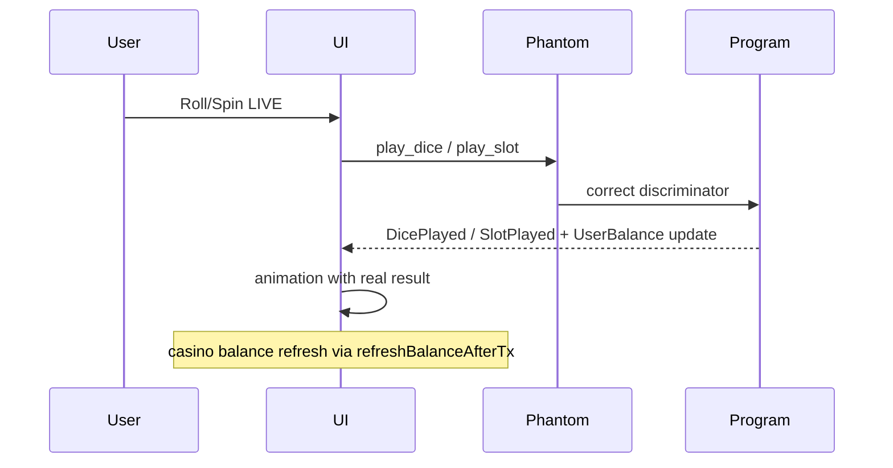

# Итерация 16

## LIVE play fix: IDL discriminators + flow order + убрать Max

> Оператор: Cursor. **Коммит it.16 — только PO.**

## PO → задача

После it.15 LIVE deposit работал, но **каждый roll/spin** падал:

1. Phantom tx на **любой** LIVE-раунд (win/lose) → `AnchorError InstructionFallbackNotFound` (101).
2. Анимация крутилась до/во время popup — казалось «сначала выиграл, потом tx».
3. Выигрыш не попадал на casino balance — play tx не проходила.
4. Кнопка **Max** у deposit/withdraw — непонятная (withdraw-only), убрать.

## Root cause

| Инструкция | On-chain (`sha256("global:play_dice")`) | Было в IDL |
|------------|----------------------------------------|------------|
| `play_dice` | `043181756623de82` | `982c535444a20619` (= camelCase `playDice`) |
| `play_slot` | `3440c9997a14c874` | `4e63b78d4b7eb522` (= camelCase `playSlot`) |

`deposit` / `withdraw` совпадали → депозит ОК, play — 101. **Redeploy не нужен** — программа на devnet содержит PlayDice/PlaySlot.

## Реализация

| Файл | Изменение |
|------|-----------|
| `types/idl/wibe_casino.json` | правильные discriminators для `play_dice`, `play_slot` |
| `tests/idl-discriminators.test.ts` | guard: `pnpm test:idl` |
| `useGameDice.ts` / `useGameSlot.ts` | LIVE: `playDice`/`playSlot` **до** анимации |
| `useCasinoProgram.ts` | map error 101 → понятное сообщение |
| `CasinoActions.vue` | убрана кнопка Max |
| `i18n/locales/*.json` | toast LIVE win → «на баланс казино»; удалён `games.common.max` |

## LIVE flow (после fix)



- **Одна** Phantom tx на раунд — ставка + исход в `UserBalance` PDA.
- В Phantom wallet WIBE меняются только при **deposit** / **withdraw**.

## QA (PO)

| Сценарий | Ожидание |
|----------|----------|
| LIVE deposit → dice roll | 1 tx, balance ±, без 101 |
| LIVE slot spin win/lose | то же |
| Reject Phantom | error toast, UI не залипает |
| Withdraw | сумма вручную (без Max) |

## Тесты

```bash
pnpm test:idl
pnpm test:env
pnpm build
```

## Метрики

| | |
|--|--|
| **Program devnet** | `BfdTrxqFfFhe4xA3XniqVWzVkQKX88za5yuA4FRq3ktw` |
| **Mint** | `He66seATY4XobvcwC8WZceMH3uncAqEx44T8HtLyttox` |
| **Коммит** | _(PO)_ |
