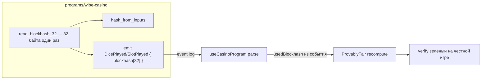

# Итерация 17

## Финальное консистентность-ревью: проверяемый on-chain рандом (blockhash в событии) + тайминг перехода

> Оператор: **Claude (Cowork)**. Ревью перед сдачей: проверка проводки on-chain, верификации рандома и UX переходов. Найдены и исправлены 2 реальных дефекта; на остальные вопросы дан ответ «работает как задумано».

---

## Что происходило

### PO

Финальная проверка на консистентность:

1. Иногда переход между страницами «доезжает и подвисает» перед сменой; анимация перехода иногда не на весь экран при скролле.
2. Правильно ли верифицируется рандом после подключения тестового кошелька (LIVE)?
3. Нормально ли, что каждый бросок/спин требует подтверждения в Phantom?
4. Как реализован счёт игрока: откуда баланс и данные о транзакциях (счёт *в казино*, не баланс кошелька)?

### Оператор (Claude) — диагноз

- **#2 — главный дефект.** Программа хешировала `recent_blockhashes` sysvar **в момент исполнения** транзакции, а фронт пересчитывал по blockhash, прочитанному **до** отправки. Между этим проходит слот-другой → 32 байта другие → на **честных** LIVE-роллах вкладка Fair могла показывать MISMATCH. Событие `DicePlayed/SlotPlayed` использованный blockhash не отдавало → клиент не мог узнать точный вход.
- **#1 — тайминг.** `router.push` стоял в `onComplete` matrix-таймлайна (≈1.4 с) → навигация + монтирование новой страницы происходили в самом конце, отсюда ощущение «замерла-переключилась».
- **#3, #4 — не дефекты** (см. ниже «Ответы»).

### Реализовано



**1. Проверяемый рандом (главный фикс).**

| Слой | Изменение |
|------|-----------|
| `programs/wibe-casino/src/lib.rs` | `read_blockhash_32()` читает 32 байта один раз; `hash_from_inputs/compute_roll/compute_symbol` принимают `&[u8;32]`; в события `DicePlayed`/`SlotPlayed` добавлено поле `blockhash: [u8;32]` (ровно те байты, что хешировались). |
| `composables/useCasinoProgram.ts` | Парсит `blockhash` из события и использует его как **авторитетный** вход возвращаемого meta (`toBytes32`). Forward-compatible: нет поля (старый IDL) → прежний префетч-фолбэк. |
| `components/games/ProvablyFair.vue` | Уже берёт `blockhash`/`blockhashBase58` из meta → recompute сходится на честной игре. |

**2. Тайминг перехода.**

| Файл | Изменение |
|------|-----------|
| `components/motion/MatrixTransitionOverlay.vue` | `router.push` перенесён на **середину** анимации (под непрозрачным overlay) через `tl.call(... route*0.5)`; флаг `navigated` исключает двойную навигацию; `finishMatrix` по-прежнему гарантированно вызывает `unlockMotion()`. |

---

## Ответы PO (не дефекты)

- **#3 Phantom на каждый ролл — норма.** Каждая ставка — отдельная on-chain транзакция (`.rpc()` → подпись). Это и есть «verifiable on-chain». Авто-роллы логично оставить **FUN**-фичей (в LIVE дёргали бы попап каждый раунд).
- **#4 Счёт игрока — on-chain PDA `UserBalance`** (`[USER_BALANCE_SEED, casinoConfig, wallet]`), поля `amount` + `game_nonce`. Баланс читается **с чейна** (`getAccountInfo` → декод), а не из виджета Phantom. Deposit/withdraw двигают SPL между ATA пользователя и `casinoVault` (PDA). Результат раунда берётся из события транзакции; баланс перечитывается после подтверждения.

---

## ⚠️ Обязательно для PO перед заливкой LIVE (синхронно!)

Поле события изменилось → IDL и задеплоенная программа **должны совпадать**:

```bash
anchor build && pnpm copy-idl && anchor deploy --provider.cluster devnet
```

Проверка: честный LIVE-ролл → вкладка **Fair** → **Verify** = зелёный (а ломая reportedRoll руками — красный). До передеплоя фронт работает по фолбэку (без регресса).

---

## Проверки

| Что | Результат |
|-----|-----------|
| RNG-математика (FNV + per-reel stride) | не менялась → `tests/rng-verify` валиден |
| Целостность Rust (сигнатуры/эмит) | ✅ `compute_*` → u8, `read_blockhash_32` → Result, blockhash в обоих событиях |
| Фронт (parse + use emitted blockhash) | ✅ dice + slot, `toBytes32` фолбэк |
| Сборка / деплой / LIVE-verify | ⏳ у PO на хосте после передеплоя |

---

## Ресурсы

| | |
|---|---|
| **Оператор** | Claude (Cowork) — финальное ревью |
| **Файлы** | `lib.rs`, `useCasinoProgram.ts`, `MatrixTransitionOverlay.vue` |
| **Расход** | см. Settings → Usage (Cowork точный токен-каунт не даёт) |

**Коммит (ожидается):** `fix: iteration 17 — emit blockhash for verifiable LIVE RNG + mid-animation route nav`
