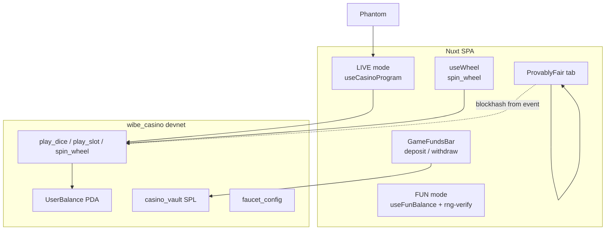
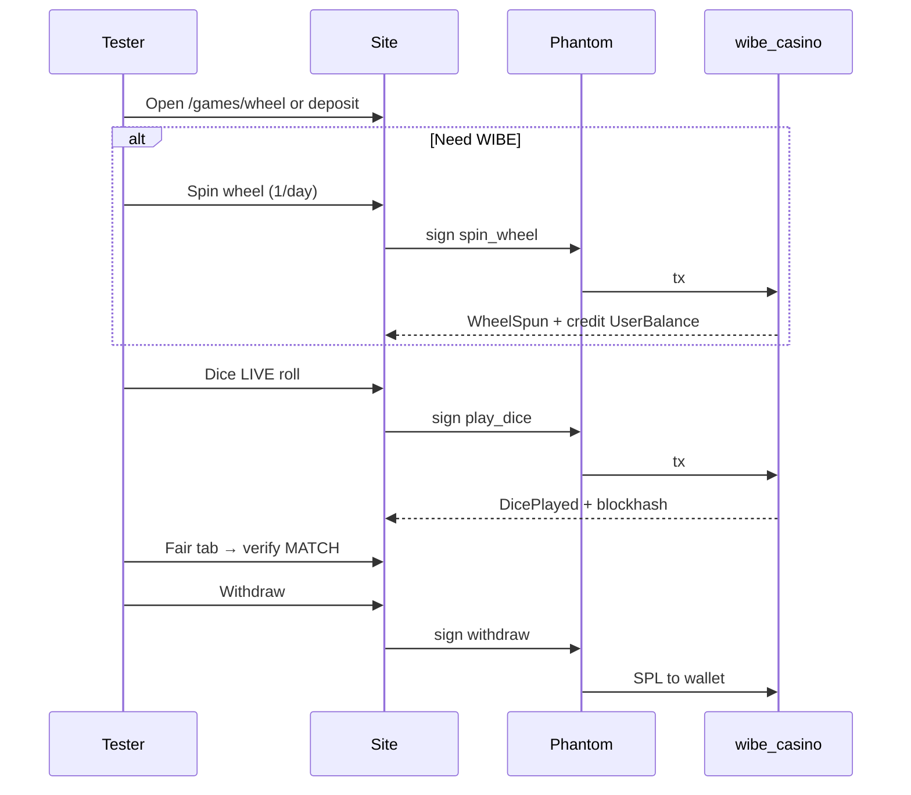
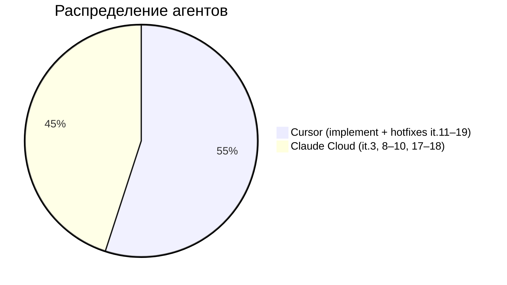

# Итерация 19 — финал марафона (it.17 → it.18 + hotfixes)

> **Статус:** submission-ready · [truebrutal.netlify.app](https://truebrutal.netlify.app)  
> PO: Aleksey · агенты: Claude (Cowork) it.17–18, Cursor it.16 + финальные UX/hotfixes

## Зачем этот отчёт

Закрывающий документ после 48h Vibe-Code Challenge: что в продукте **сейчас**, что добавили после it.16, что проверено, что честно остаётся ограничением, и что PO делает перед отправкой в Notion/TG.

---

## Хронология финального спринта

| Этап | Коммиты (примерно) | Суть |
|------|-------------------|------|
| **it.17** | `71b07a6` … `a532e3f` | Blockhash в `DicePlayed`/`SlotPlayed`; Fair tab на честных LIVE-роллах; matrix route mid-animation |
| **it.18** | `4eb464f` | WIBE Wheel: `init_faucet` + `spin_wheel`, баннер в лобби, `/games/wheel` |
| **Hotfixes** | `fcfc3ac` … `ec765b0` | Deposit UX, autoroll layout, skip-prompt, Phantom freeze mutex, wheel cancel |
| **Доки** | `3fd29dd` | README: wheel + «Why you can trust it» |
| **Локально (PO)** | _uncommitted_ | Вкладки «Как работает» / «Трастовость» на странице колеса + блок про SOL rent |

---

## Challenge — чеклист сдачи

| Требование | Статус | Где |
|------------|--------|-----|
| Testnet only | ✅ | Solana devnet, `netlify.toml` |
| Connect wallet | ✅ | Phantom, crack modal |
| Deposit → play → withdraw | ✅ | `GameFundsBar` + dice/slot LIVE |
| Verifiable on-chain | ✅ | Fair tab + `WheelSpun` auditable |
| Public URL | ✅ | [truebrutal.netlify.app](https://truebrutal.netlify.app) |
| Casino edge | ✅ | 200 bps on-chain (`house_edge_bps`) |
| Две+ игры | ✅ | Dice + Slot (+ Wheel как faucet) |
| Polished UX | ✅ | FUN/LIVE, i18n EN/RU/UK, mobile, motion |

---

## Архитектура (финал)



---

## Что добавлено / исправлено (it.17–19)

### it.17 — verifiable RNG (Claude)

- Программа читает blockhash **один раз** и эмитит его в событии.
- Front: `useCasinoProgram` + `ProvablyFair` используют blockhash из события, не pre-fetch.
- Matrix: навигация в середине overlay (it.09 follow-up).

**⚠️ Оператор:** если на devnet ещё старый `.so` — `anchor build && pnpm copy-idl && anchor deploy --provider.cluster devnet`.

### it.18 — WIBE Wheel (Claude)

- On-chain: `init_faucet`, `spin_wheel`, `FaucetConfig`, `FaucetClaim`, skewed 1..1000.
- Front: `WheelBanner`, `/games/wheel`, `pnpm devnet:faucet`.
- Не Fair-tab: faucet giveaway, не ставка.

**⚠️ Оператор:** после deploy — `pnpm devnet:faucet` (vault + init pool 3333 WIBE).

### Hotfixes (Cursor + PO, commits «… end ?» / «фиксы»)

| Область | Файлы | Суть |
|---------|-------|------|
| Deposit label | `CasinoActions.vue` | Убран дубль «Депозит / Вывод» → «Сумма (WIBE)» |
| Autoroll mobile | `GameAutoFsBar.vue` | Сетка, Lucide ∞, «Стоп при выигрыше» крупнее |
| Skip prompt | `useAutoPlay.ts`, `GameAutoFsBar`, `BrutalAlert` | После 3 cancel подряд — модалка; timeout 20s |
| Phantom freeze | `shared/live-play-mutex.ts`, dice/slot | Очередь LIVE RPC; pause после skip; `resetStaleUiLocks` |
| Wheel stuck popup | `useWheel.ts`, `WheelGame.vue` | `cancelSpin` если Phantom скрыли без approve/reject |

### Документация

- `README.md` — wheel runbook + provably fair narrative.
- Страница колеса (локально): вкладки **Как работает** (skew, rent SOL) и **Трастовость** (on-chain audit, scope vs Fair).

---

## QA (прогон 31.05.2026)

```bash
pnpm test:env          # 2/2 ✅
pnpm test:idl          # 7/7 ✅ (play_* + faucet ix)
pnpm exec vitest run tests/rng-verify.test.ts tests/live-play-mutex.test.ts  # 16/16 ✅
pnpm build             # ✅ prerender: /, /games/dice, /games/slot, /games/wheel
```

| Сценарий | Ожидание |
|----------|----------|
| FUN dice/slot без wallet | Roll/spin, fun credits |
| LIVE deposit → play → withdraw | GameFundsBar, Phantom tx |
| Fair tab после LIVE win | MATCH на blockhash из события (it.17 on-chain) |
| Autoroll + reject Phantom ×3 | Модалка continue/stop; UI не залипает (mutex) |
| Wheel spin | +WIBE на casino balance; 24h cooldown |
| Lobby banner | Фонд + CTA → `/games/wheel` |

---

## Честные ограничения (для Notion)

1. **Phantom на каждый LIVE roll/spin** — by design для on-chain verify; session keys не делали (~2–4 дня).
2. **Wheel вне Fair tab** — skewed faucet, не contest; но `WheelSpun` + Explorer auditable.
3. **Program upgrade** — it.17 blockhash-in-events и it.18 wheel требуют актуального deploy на devnet.
4. **Phantom dismiss без reject** — частично mitigated (`cancelSpin`, mutex, timeout); edge cases возможны → reload.

---

## Runbook PO перед отправкой

1. **Commit** незакоммиченные wheel tabs (`WheelGame.vue` + i18n) — см. `git status`.
2. **Deploy program** (macOS host): `anchor build --no-idl || true` → deploy `.so` → при необходимости `pnpm copy-idl`.
3. **Faucet:** `pnpm devnet:faucet` ×2 (fund vault + init).
4. **Netlify:** push `main` → дождаться build.
5. **Smoke на телефоне:** connect → wheel OR deposit → dice LIVE → Fair → withdraw.
6. **Notion:** URL + program id + mint + скрины + ссылка на [`README.md`](../README.md) trust section.

---

## Ключевые ID

| | |
|---|---|
| **Program** | `BfdTrxqFfFhe4xA3XniqVWzVkQKX88za5yuA4FRq3ktw` |
| **Mint WIBE** | `He66seATY4XobvcwC8WZceMH3uncAqEx44T8HtLyttox` |
| **Live URL** | https://truebrutal.netlify.app |

---

## Инфографика: путь тестера



---

## Бюджет AI (PO, финал марафона)



| Агент | Что сделал | Лимиты / деньги |
|-------|------------|-----------------|
| **Cursor (Auto)** | it.11–16 LIVE wire, funds bar, IDL fix; it.19 autoroll/mutex/wheel UX | Included **$20** исчерпан на it.5; it.12–15 **+$26 overage** (it.15); финальный хвост it.16–19 **>+$40 on-demand** (PO dashboard) |
| **Claude (Cowork / Cloud)** | it.3 lobby; it.8–10 polish; it.17 verifiable RNG; it.18 wheel | **4 полных лимита сессии Cloud** (~75–100% каждый на it.3, 8–10, 17–18) |

**Итого ориентир PO:** Cursor **>$66** сверх included ($20 + $26 + $40+) · Claude **4× reset лимита** · Solana/Anchor deploy — на macOS хосте PO, не в sandbox агентов.

> Точные цифры Cursor: Settings → Usage. Claude: Team Usage / Cowork session caps.

---

| | |
|---|---|
| **Токены (Cursor AI)** | it.16–19 + marathon tail — см. Usage dashboard |
| **USD (Cursor on-demand)** | **>$40** (it.16–19 hotfixes; сверх +$26 it.12–15 и $20 included) |
| **USD (Cursor cumulative)** | **~$86+** оценка PO (included $20 + overage $26 + on-demand $40+) |
| **Claude Cloud** | **4 лимита сессии** (it.3, 8–10, 17–18) |
| **Время PO** | ~48h challenge window · финальный QA ~2–3 ч |
| **Агенты** | Claude it.3, 8–10, 17–18 · Cursor it.11–19 · PO deploy + commits |
