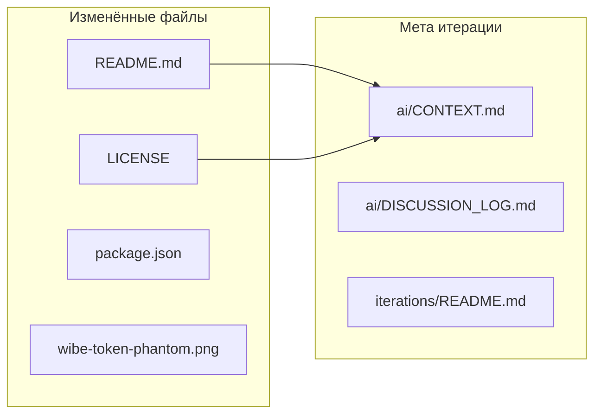

# Итерация 20 — README по блокам + MIT license

> **Docs-only:** публичное описание репозитория и лицензия. Код игр, on-chain и redeploy **не трогали**.

## PO → задача

После 🥇 в Vibe-Code Challenge — «причесать» README для GitHub/Notion: убрать медаль из заголовка, блоки вместо портянки, скрин WIBE в Phantom, явно описать Wheel (только LIVE + кошелёк), MIT license. Игры и redeploy devnet **не трогаем** (репа на другом ПК без keypairs).

## Архитектор → понимание

| Было | Стало |
|------|-------|
| `# Brutal wibe :first_place_medal: 1st Place` | `# Brutal wibe` |
| Wheel + trust + how-to-play — три раза одно и то же | 9 блоков: Hero → Token → Play → Games → Trust → Dev → Stack → License → Challenge |
| Нет LICENSE | MIT в корне + `"license": "MIT"` |
| Нет визуала токена | `public/wibe-token-phantom.png` в README |
| 🥇 в шапке | Призы в `<details>`, сноска в конце Challenge |

## Уточнения PO

- **Scope сужен:** только docs; dice multiplier, slot UX, wheel animation, `anchor deploy` — отложено.
- **Redeploy:** не нужен для it.20; для будущих on-chain фиксов — keypairs с машины первого deploy.

## Реализация



### Файлы в коммите

| Файл | Суть |
|------|------|
| [`README.md`](../README.md) | 9 блоков; known limits (dice 1.95×, wheel pool `—`) |
| [`LICENSE`](../LICENSE) | MIT |
| [`package.json`](../package.json) | `"license": "MIT"` |
| [`public/wibe-token-phantom.png`](../public/wibe-token-phantom.png) | Скрин Phantom, mint `He66se…` |
| [`iterations/20-readme-license.md`](./20-readme-license.md) | Этот отчёт |
| [`iterations/README.md`](./README.md) | Строка it.20 (hash — после коммита PO) |
| [`ai/CONTEXT.md`](../ai/CONTEXT.md) | it.20 + known limitations |
| [`ai/DISCUSSION_LOG.md`](../ai/DISCUSSION_LOG.md) | Решение scope docs-only |

### README — оглавление (новое)

| # | Блок | Ключевое |
|---|------|----------|
| 1 | Hero | one-liner + truebrutal.netlify.app |
| 2 | WIBE token | mint, скрин, «Unknown Token» OK |
| 3 | Play now | таблица FUN/LIVE, fund tester |
| 4 | Games | Dice / Slot / **Wheel = LIVE + Phantom** |
| 5 | Trust | Fair tab, rng-verify, wheel ≠ Fair |
| 6 | For developers | pnpm, Netlify, deploy.md |
| 7 | Stack + Status | ссылка на it.19 |
| 8 | License | MIT |
| 9 | Challenge | brief + footnote 🥇 1st |

### Out of scope (зафиксировано)

| Тема | Почему отложено |
|------|-----------------|
| Dice odds multiplier | Нужен `lib.rs` + redeploy |
| Slot payout UX (×2 vs +96) | Код UI / i18n |
| Wheel pool без wallet | `useWheel.ts` |
| Wheel animation sync | `WheelGame.vue` |

## QA (перед push)

| # | Проверка | Статус |
|---|----------|--------|
| 1 | `# Brutal wibe` без медали | ✅ |
| 2 | Footnote 🥇 в конце Challenge | ✅ |
| 3 | Wheel: LIVE + Phantom в блоке Games | ✅ |
| 4 | `LICENSE` MIT в корне | ✅ |
| 5 | Скрин в `public/` — после push проверить рендер на GitHub | PO |
| 6 | `pnpm build` — без регрессий (код игр не менялся) | PO опционально |

## Коммит PO

```bash
git add README.md LICENSE package.json public/wibe-token-phantom.png \
  iterations/20-readme-license.md iterations/README.md \
  ai/CONTEXT.md ai/DISCUSSION_LOG.md
git commit -m "feat: iteration 20 — README blocks + MIT license"
```

После коммита — дописать hash в таблицу «Связь с git» в [`iterations/README.md`](./README.md).

---

| | |
|---|---|
| **Токены (Cursor AI)** | it.20 session, docs-only (~1 pass) |
| **USD** | PO: Cursor Usage dashboard |
| **Время PO** | ~10–15 мин review + commit + проверка README на GitHub |
